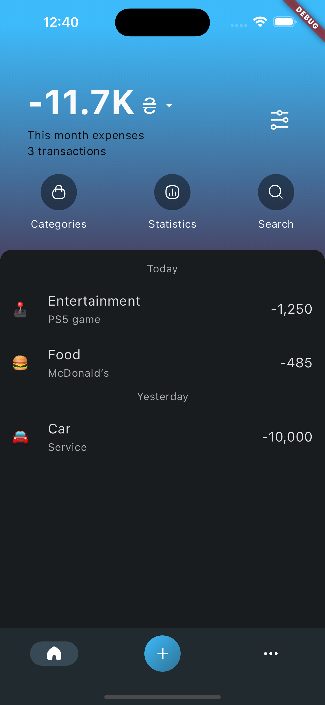
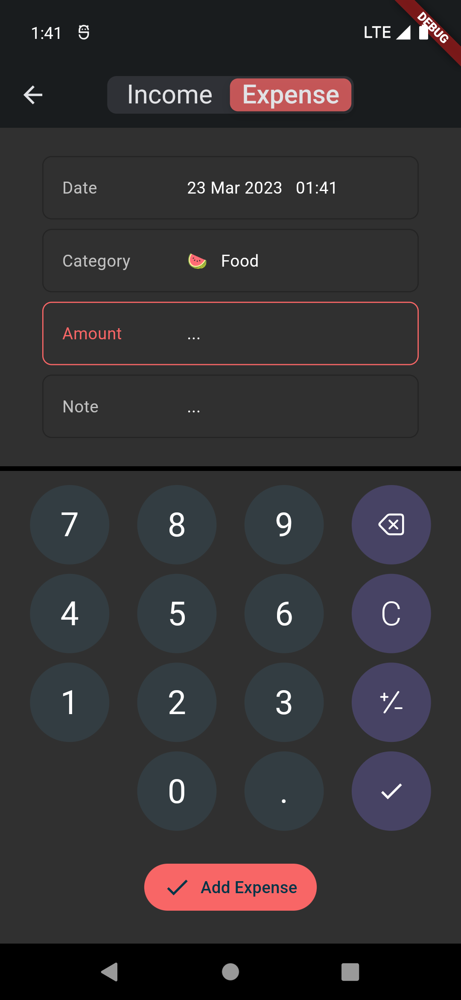

## Money Manager
#### 🚧 Work in progress 🚧
Track your financial transactions effortlessly with this open-source app.

## Technologies
- [Flutter](https://flutter.dev)
- [Riverpod](https://riverpod.dev)
- [Isar](https://isar.dev)
- [Shared Preferences](https://github.com/flutter/packages/tree/main/packages/shared_preferences/shared_preferences)
- [Freezed](https://github.com/rrousselGit/freezed)
- [Equatable](https://github.com/felangel/equatable)

## Architecture Blueprint

## Screenshots

  
  
  

